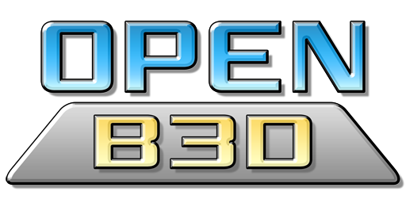

## Introduction

OpenB3DMax is an OpenGL 1+ 3D engine for BlitzMax which is based on [Minib3d](https://github.com/si-design/minib3d) which was based on Blitz3D. Since the standard commands are the same, the Blitz3d manual can be used as a partial reference. Help can be found at the SyntaxBomb [MiniB3d Board](http://www.syntaxbomb.com/index.php/board,20.0.html).

## Features 

* Works with [BlitzMax NG](https://github.com/bmx-ng/bmx-ng/releases) in 32-bit or 64-bit on Windows, Mac or Linux (currently no mobile platforms)
* The wrapper is object-oriented with a procedural interface as in Minib3d
* Minib3d types are the same but all fields are pointers apart from lists, also variable names may not be the same
* Since entities are objects not integer handles as in Blitz3D you need to specify their type at creation
* The coordinate system is flipped from OpenGL orientation to be left-handed as in Blitz3d and Minib3d
* Works with BRL.MaxGui as in Minib3d, for control of application windows
* BRL.Max2d is used for 2D-in-3D rendering which along with BRL.Graphics is like Blitz3d's graphics commands
* Image loading is done by the STB image library which supports JPG, PNG, TGA, BMP, GIF and others
* Loads DDS files with mipmaps or compressed textures
* Supports streams like Incbin and [Zipstream](https://github.com/maxmods/koriolis.mod) with Blitz image loaders and mesh loaders
* 3D Model formats include 3DS (currently no animation), B3D (skeletal animation) and MD2 (vertex interpolation)
* Several more formats can be loaded using the Assimp library wrapper (currently no animation)
* Collision detection consists of Blitz3d's ellipsoid-to-something collisions, also includes dynamic collisions
* Realtime textures are created with BackBufferToTex (cubemapping) or CameraToTex for use in post-processing effects
* Quaternions are used for rotations instead of Eulers as in Minib3d, this avoids gimbal lock
* Terrains are much like Blitz3D but UpdateNormals replaces TerrainShading and TerrainDetail is a constant
* Vertex and Fragment shaders are supported with examples written to comply with GLSL 1.10 (GL 2.0) syntax
* Shader effects currently include bump mapping, toon shading, blur and bloom
* Dynamic lighting and linear fog either with fixed function or programmable graphics pipelines (ie. shaders)
* Realtime volumetric stencil shadows with self-shadowing from multiple lights
* Stencil commands for rendering mirror or portal effects
* Particle emitter system with support for custom effects by using a callback function
* CSG (constructive solid geometry) creates a new mesh from existing ones (combine, subtract or intersect)
* Actions are an event-based entity control system, they are triggered once and then automatically updated
* Simple physics system consisting of constraints and rigid bodies
* 3D sound module using Brl.Audio, similar to the Blitz3D commands but sounds can be qued, stopped, paused and resumed per entity.

## Installation
* Copy **openb3dmax.mod** to the `MyBlitzMax/mod` folder, module folder names must end in **.mod**
* If Windows, make sure you have a working version of MinGW. If Mac, make sure you have XCode installed. If Linux, read this guide:
 [How To: Install BlitzMax NG on Win/Mac/Ubuntu 64-bit](https://www.syntaxbomb.com/index.php/topic,61.0.html)
* Open a Terminal, cd to `MyBlitzMax/bin` and for BRL Bmx type `bmk makemods -a -d openb3dmax`
* For NG in 64-bit use `bmk makemods -a -d -w -g x64 openb3dmax`, if on Mac/Linux use `./bmk`
* Or in MaxIDE make sure Quick Build, Debug, GUI App are on, then click Programs > Build Modules

## Status

After returning to work on this wrapper in my spare time, my plan is to get it into a finished and bug-free state. Since Angros has a working GLES2/WebGL version I will probably try to add Android support from NG, but this is not a priority. It should work with the latest NG release (currently 0.93) but please note it is not working with modern compilers like GCC 7.x or Clang/LLVM, so for now use an older compiler.

## License

The library is licensed with the GNU LGPL 2.1 or later with an exception to allow static linking. The wrapper is licensed with the zlib license and one module with the BSD-2-Clause license.

